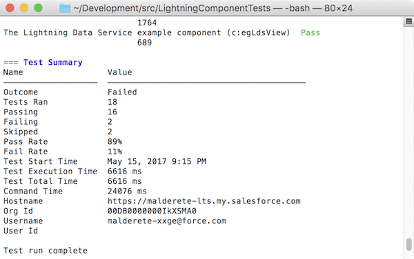
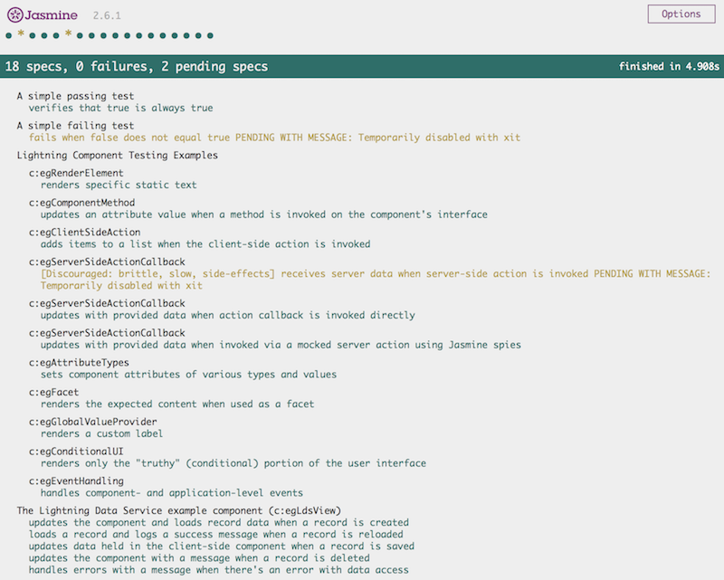

# Lightning Testing Service (LTS) [](https://travis-ci.org/forcedotcom/LightningTestingService) [](https://circleci.com/gh/forcedotcom/LightningTestingService/tree/master)

## Lightning Testing Service Overview

The Lightning Testing Service, or LTS, is a set of tools and services that let you create test suites for your Lightning components using standard JavaScript test frameworks, such as Jasmine and Mocha.

Automated tests are the best way to achieve predictable, repeatable assessments of the quality of your custom code. Writing automated tests for your custom components gives you confidence that they work as designed, and allows you to evaluate the impact of changes, such as refactoring, or of new versions of Salesforce or third-party JavaScript libraries.

The LTS supports testing with standard JavaScript test frameworks. We provide easy-to-use wrappers for using [Jasmine](https://jasmine.github.io/) and [Mocha](http://mochajs.org/). If you prefer to use an alternative test framework, you can wrap it yourself. (See [Next Steps](#next-steps) for some details.)

## Getting Started with Lightning Testing Service

LTS and [Salesforce DX](https://developer.salesforce.com/platform/dx) are two great tastes that taste great together. Installing the LTS is a one line command in the Salesforce DX CLI. Once installed, you can work with your test suite in a variety of ways from the command line. This approach also facilitates systematic automated testing.

> **Note:** If you just want to “kick the tires,” that's cool, too. You can manually install the LTS unmanaged package. The package provides the test service app and an example test suite. It also includes example components that the test suite runs against. You run the test suite by accessing the URL for the LTS app in your org.

Write your tests using a JavaScript testing framework of your choosing. We provide easy-to-use wrappers for [Jasmine](https://jasmine.github.io/) and [Mocha](http://mochajs.org/). 

A simple Jasmine test spec looks like the following:

```js
/**
 * This is a 'hello world' Jasmine test spec
 */
describe("A simple passing test", function() {
    it("checks that true is always true", function() {
        expect(true).toBe(true);
    });
});
```

A similar Mocha test looks, well, similar:

```js
/**
 * This is a 'hello world' Mocha test 
 */
var assert = require('assert');
describe('Test the nature of truth', function() {
    describe('A simple passing test', function() {
        it('checks that true is always true', function() {
            assert.equal(true, true);
        });
    });
});
```

You can write your own wrapper if you prefer a different testing framework. It's not hard, but plan on half a day to a day of work.

The LTS also provides utilities specific to the Lightning Component framework, which let you test behavior specific to Lightning components. Details are explained in comments in the example tests.

Your test suite is deployed in the form of an archive (zip) static resource. Once the LTS is installed and configured, you make changes to your test suite, create the archive, and upload it to your org. Once uploaded you can run the test suite via the command line or via URL.

> **Important:** Don't run tests in your production org. The LTS doesn't provide an isolated test context or transaction wrapper. **DML operations you perform in your tests won't be rolled back at the end of the test.** We recommend that you run your LTS test suites _only_ in scratch orgs, using data provided by the test suite itself.

## Installing the Lightning Testing Service

There are two ways you can install the LTS. The simplest is to use the Salesforce DX CLI. If you're not using Salesforce DX, you can manually install the unmanaged package. 

### Install the Lightning Testing Service with Salesforce DX

Salesforce DX includes a one line command for automatically installing the LTS unmanaged package. The Salesforce DX CLI also allows you to use the `sfdx` command line tool to perform automated testing as part of your development process, including automated process, such as continuous integration.

1. If you haven't already, install the Salesforce DX CLI by following the instructions for your operating system: 
    
    [Install the Salesforce DX CLI](https://developer.salesforce.com/docs/atlas.en-us.sfdx_setup.meta/sfdx_setup/sfdx_setup_install_cli.htm) in the _Salesforce DX Setup Guide_

2. Verify that the Salesforce DX CLI plug-in is installed and updated by running the following command in your shell or terminal application:
    
    ```bash
    sfdx update
    ```
    
    Additional verification details are available in [Verify Your Installation and Install the Plug-In](https://developer.salesforce.com/docs/atlas.en-us.sfdx_setup.meta/sfdx_setup/sfdx_setup_install_cli_verify.htm) in the _Salesforce DX Setup Guide._

3. Install the LTS package with the following command:
    ```bash
    sfdx force:lightning:test:install
    ```
    
    This installs the latest version of the LTS package into your default SFDX org. See the help for the `install` command for additional options.

After you install LTS, you can run your tests from the command line using the `sfdx` tool. For example:

```bash
sfdx force:auth:web:login -s     # connect to your scratch org
sfdx force:source:push           # push local source to the scratch org
sfdx force:lightning:test:run -a jasmineTests.app   # run the test suite
```

When you run the `force:lightning:test:run -a jasmineTests.app` command in a connected workspace you should see something like the following:



This tells you that the command line tools are working, and connected to your development org.

### Install the Lightning Testing Service Unmanaged Package Manually

If you're not using Salesforce DX, you're missing out on a lot, but you can still use LTS. Installing the LTS package is just like [installing any other unmanaged package](https://help.salesforce.com/articleView?id=distribution_installing_packages.htm&language=en&type=0).

1. Log in to your org. We recommend that you create a new DE org for evaluating the LTS.
2. Go to the project [Releases](https://github.com/forcedotcom/LightningTestingService/releases) page, and click the package installation URL for the latest release.
3. Authenticate again with the credentials for your DE org.
4. Follow the normal package installation prompts. We recommend installing the package for admins only.

## Touring the Lightning Testing Service

However you install it, the LTS package includes the following items:

 * Example test suites
     - Jasmine JavaScript files in archive static resources
     - Mocha JavaScript files in archive static resources
 * Example components to be tested
     - Components, an Apex class, and a custom label
 * LTS infrastructure
     - Jasmine framework and wrapper
     - Mocha framework and wrapper
     - LTS test utilities
     - Test runner component
     - Wrapper test app

Once installed, you can run the example test suite by going to the following URL in your org:
<code>https://<em>&lt;myServer&gt;</em>/c/jasmineTests.app</code> (Jasmine)
<code>https://<em>&lt;myServer&gt;</em>/c/mochaTests.app</code> (Mocha)

You should see a screen that looks something like the following.



This page tells you that the package is correctly installed and LTS is working in your org.

## Next Steps

When you have the LTS package installed and working in your org, you’re ready to begin exploring the test code, and even writing your own tests. Here are some next steps for you to take.

### Explore the Example Test Suites

To dive into the test suites and start learning how to write tests for your Lightning components, explore the tests and the components being tested side-by-side. You’ll want to open the test suite file in one window, and in another window (perhaps in your IDE) open the simple components being tested.

Both the components and the test suites included in the unmanaged package are also available in a repository on GitHub:

[https://github.com/forcedotcom/LightningTestingService](https://github.com/forcedotcom/LightningTestingService)

#### Components for Testing

All of the testable components are named beginning with “eg” (from the abbreviation “e.g.”, meaning _for example_). The components provided in the package can be accessed as you would any Lightning component.

 * In the Developer Console
 * In the Force.com IDE, in the `/aura/` directory
 * By converting your org’s metadata into a format that you can work with locally, using Salesforce DX

You can also explore the components directly from the repo. They’re available in the [lightning-component-tests/main/default/aura](https://github.com/forcedotcom/LightningTestingService/tree/master/lightning-component-tests/main/default/aura) directory.

There are more than a dozen different components, designed to be used in illustrative tests. Each of the components has a description of its behavior in its `.auradoc` documentation file.

#### Test Suites

The example tests are included in the form of static resources. You can also review them directly in the repo, in the [lightning-component-tests/test/default/staticresources](https://github.com/forcedotcom/LightningTestingService/tree/master/lightning-component-tests/test/default/staticresources) directory.

There are four test suites included in the LTS package, three for Jasmine and one for Mocha:

 * `jasmineHelloWorldTests.resource` — A very simple Jasmine example including one passing and one failing test.
 * `jasmineExampleTests.resource` — The main Jasmine example test suite.
 * `jasmineLightningDataServiceTests.resource` — Some Jasmine examples specific to testing Lightning Data Service-based components.
 * `mochaExampleTests.resource` — The Mocha example test suite, which provides examples parallel to the main Jasmine test suite.

The remainder of the static resources are infrastructure used by the LTS. They’re _briefly_ described in [Use Another JavaScript Test Framework](#use-another-javascript-test-framework).

The `jasmineExampleTests.resource` and `mochaExampleTests.resource` files are each a single JavaScript file containing a complete test suite. It’s a single file for convenience in delivery and exploration. Your own test suites can include many such files. The test suites are copiously commented. The code and comments serve as the official documentation for how to write tests.

### Write Your Own Tests

A separate document, [Testing Lightning Components with the Lightning Testing Service](https://github.com/forcedotcom/LightningTestingService/blob/master/developer-workflow.md), describes the flow, or lifecycle, of using the LTS to automate your testing. Once you’ve explored the example tests, use this document to dive into writing a test suite for your own custom components.

### Use Another JavaScript Test Framework

The Lightning Testing Service provides a way to use standard JavaScript test frameworks with your Lightning components. We’ve provided the example test suites implemented in [Jasmine](https://jasmine.github.io/) and [Mocha](http://mochajs.org/). These are well-regarded test frameworks, and if you haven’t chosen one already, we recommend you start with one of them.

If you’d prefer to use another test framework, either because you’ve already selected one, or because you find something more to your taste, you can use it with the LTS instead.

All of the packaged pieces of the LTS are included in the project repository, in the [lightning-component-tests/test/default](https://github.com/forcedotcom/LightningTestingService/tree/master/lightning-component-tests/test/default) directory. The pieces you’ll need to modify or replace are the following items, drawn from the Jasmine wrapper.

 * `aura/jasmineTests` — The front end of the LTS, this simple app includes the test runner component, and a list of test suites to feed it.
 * `aura/lts_jasmineRunner` — The test runner component for Jasmine. It includes references to the required Jasmine library, which it loads along with the test spec resources, and then fires the test runner.
 * `lts_jasmine.resource` — The Jasmine library, unmodified.
 * `lts_jasmineboot.resource` — A JavaScript IIFE that launches Jasmine in the LTS context.
  * `lts_testutil.resource` — A collection of utilities for use within your test specs, and by the test framework wrappers. They provide Lightning component-specific functions that make it easier to test your custom components from a test context.

The Mocha version of the framework wrapper provides similar files. You might find the similarities and differences instructive in creating your own adapter for other frameworks.

If you’re already experienced with setting up another test framework, adapting the Jasmine examples should take you a day or so, but not longer. We’d be thrilled to hear more about your adventures with other JavaScript test frameworks!
