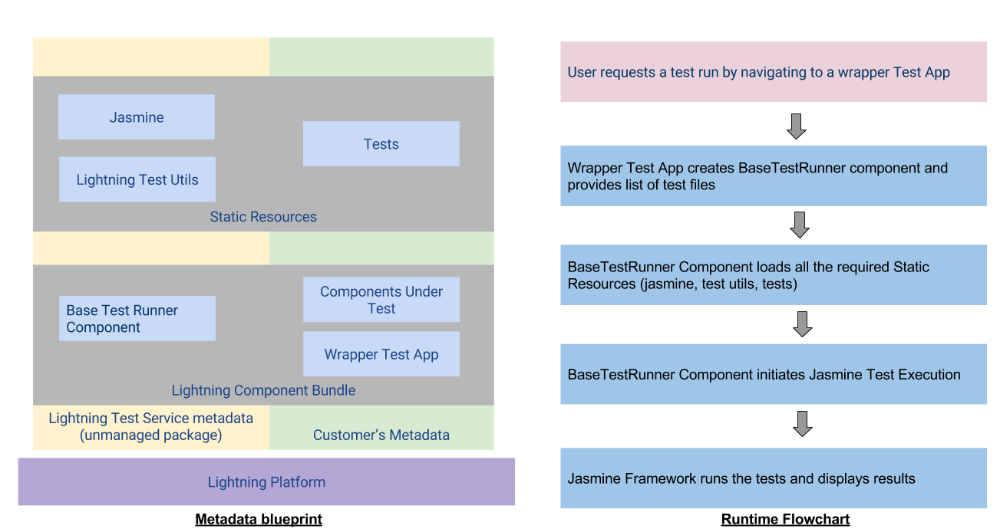

# Lightning Component Tests
## Project Goal
Showcase reusable functional test patterns (testing eventing, renderering, callbacks etc.) for Lightning Components using Jasmine (a popular open-sourced javascript testing framework). 

Integration between Lightning and Jasmine showcased in this repo will also be made avaialble as an unmanaged package. Developers building Lightning Components will be able to focus on authoring tests for their customizations by using the package in conjunction with SFDX integration (for streamlined dev and CI workflow).

## Metadata Visualization and Runtime Flowchart

## Getting Started
##### Sample wrapper test application [Test.app](lightning-component-tests/test/default/aura/Tests/Tests.app)
##### Example Lightning Component Tests [exampleTests.resource](lightning-component-tests/test/default/staticresources/exampleTests.resource)
##### Sample [Components](lightning-component-tests/main/default/aura) Under Test

# Setup and Dev Workflow
## cli setup

#### Option 1: SFDX standanlone executable
https://salesforce.quip.com/zHcMAbY3lpA8

#### Option 2: Via Heroku CLI (having some issues)
*brew install heroku*   (see https://devcenter.heroku.com/articles/heroku-cli)

*heroku plugins:install salesforcedx*  

## scratch org setup

*sfdx force:auth:web:login -d*  (login to hub org)

*sfdx force:org:create -s -f config/workspace-scratch-def.json -a scratch1*

## dev flow 

*sfdx force:source:push*  (push changes to scratch org)

*sfdx force:org:open*  (login to scratch org)

* For a manual run, visit one of the test apps (e.g. /c/Tests.app)

*sfdx force:testrunner:run  -f test/test-runner-config.json -c local -j integration*  (trigger integration test run)

## Force IDE 2
Get installation link from description section of https://gus.my.salesforce.com/_ui/core/chatter/groups/GroupProfilePage?g=0F9B000000001qh

