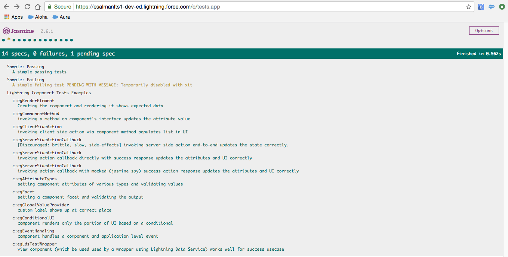
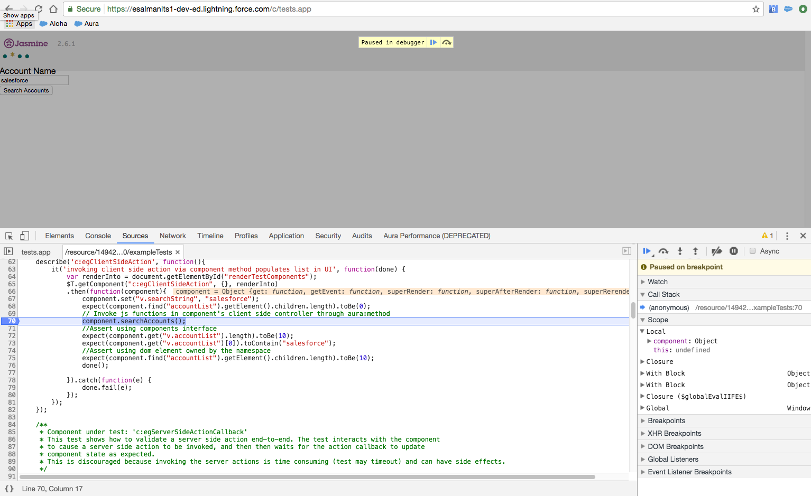

# Lightning Testing Service

The Lightning Testing Service, or LTS, is a set of tools and services that let you create test suites for your Lightning components using standard JavaScript test frameworks like Jasmine.

If you haven't already installed the LTS, start with [the project introduction](./README.md) instead of this document.

## Developer Workflows

This document provides background on how the LTS works, both by itself, and when used with Salesforce DX. We'll also describe a number of common tasks you might perform while doing development work. You can combine these tasks with each other and with your own developer processes. The workflows enabled by the LTS can significantly improve your overall development lifecycle.  

## LTS Basics and Some Theory of Operation

The LTS consists of two major components:

  * The LTS unmanaged package
  * The LTS plug-in for Salesforce DX

The unmanaged package includes LTS infrastructure, including a test runner app, and some example tests. Once the package is installed in your org, you can run the example tests by going to the following URL:
<code><em>yourInstance</em>/c/Tests.app</code>

When you run tests manually in a browser, you're using only the pieces of LTS provided in the package.


For more sophisticated development processes, use the LTS command line tool, a plug-in for Salesforce DX. It allows you to integrate the LTS into your automated testing, continuous integration, and other source-based development processes.

The command line tool automates running your test suites. It opens the same URL you can open manually, and uses WebDriver to observe the test suite as it runs. Then it parses and packages the results for use in command line-based development processes.

## Common Tasks and Workflows

Many of the tasks presented here are common to all Salesforce DX workflows. They're presented here because they're commonly used when you're writing tests, too. For more details, be sure to read the Salesforce DX documentation.

### Prerequisites

Make sure you've installed the LTS unmanaged package and the LTS plug-in for Salesforce DX, as described in [the project introduction](./README.md).

### Create a Scratch Org

It's usually best to perform automated testing in a clean org, created with consistent settings.

  1. Customize your scratch org default settings using a [scratch org configuration file](config/workspace-scratch-def.json). You can use this to specify a company name, email address, and so on.

  2. Log in to your dev hub org.
  
     ```bash
     sfdx force:auth:web:login -d
     ```
  
  3. Create a scratch org and set it as the default for your workspace.
  
     ```bash
     sfdx force:org:create -s -f config/workspace-scratch-def.json -a scratch1
     ```

### Push Metadata to a Scratch Org

Your tests are written as JavaScript files saved in archive static resources. When you update your tests locally, you need to push the new static resource to the org you're using for testing.

  1. Push local metadata to your scratch org.
  
     ```bash
     sfdx force:source:push
     ```
  
  2. Log in to your scratch org in a web browser. For example, if you need to verify behavior manually.
  
     ```bash
     sfdx force:org:open
     ```

### [Alternative] Push Metadata to a Developer Edition (DE) Org

Salesforce DX is designed to work with a dev hub org and scratch orgs. If you have a normal DE org you'd like to work with, the commands are slightly different

```bash
sfdx force:auth:web:login -s     # connect to your DE org
sfdx force:source:push -f        # push local source to the DE org
```

The ```-f``` flag forces all local changes to be pushed to the DE org. Be careful with this command! It will overwrite changes you've made in the org without warning you.

### Run Tests

For a manual test run, visit the appropriate test app, for example, <code><em>yourInstance</em>/c/Tests.app</code>.



For automated test runs, use the Salesforce DX CLI tool.

```bash
sfdx force:lightning:test:run
```

See the command line help for other useful details.

```bash
sfdx force:lightning:test:run --help
```

### Debugging Tests

When a test fails, is it a bug in your software implementation, or a bug in the test itself? Use your standard browser-based JavaScript debugging tools to investigate the behavior of both your production code and your test code.


